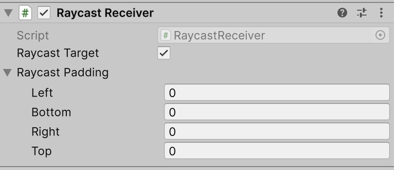

# Raycast Receiver

The **Raycast Receiver** is a non-visual Graphic component that intercepts raycasts from the [Graphic Raycaster](script-GraphicRaycaster.md). It allows you to define an area on a [Canvas](class-Canvas.md) that blocks or detects pointer events-such as clicks, touches, or hovers-without rendering any visible geometry.

This component is ideal for creating invisible interaction zones or blocking input from reaching underlying objects. Unlike an [Image](script-Image.md) component with its alpha set to zero, the [Graphic Raycaster](script-GraphicRaycaster.md) does not generate mesh data, making it a more performant solution for invisible hit-testing.

## Properties

| **Property:**       | **Function:**                                                                                                                                        |
|:--------------------|:-----------------------------------------------------------------------------------------------------------------------------------------------------|
| **Raycast Target**  | Enable **Raycast Target** if you want Unity to consider the image a target for raycasting.                                                           |
| **Raycast Padding** | Space added to the [RectTransform](class-RectTransform.md) for raycasting.                                                                           |

Raycast Receiver inherits from the Graphic class, visual properties such as [Color](https://docs.unity3d.com/ScriptReference/Color.html) and [Material](https://docs.unity3d.com/Manual/class-Material.html) remain exposed in the API. However, these properties have no effect on the component, as the Raycast Receiver does not generate any renderable geometry.
