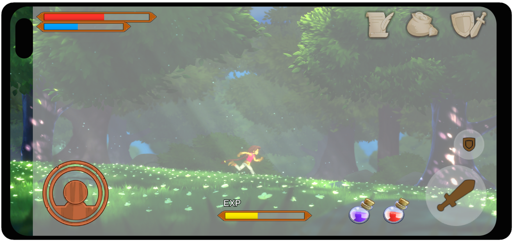
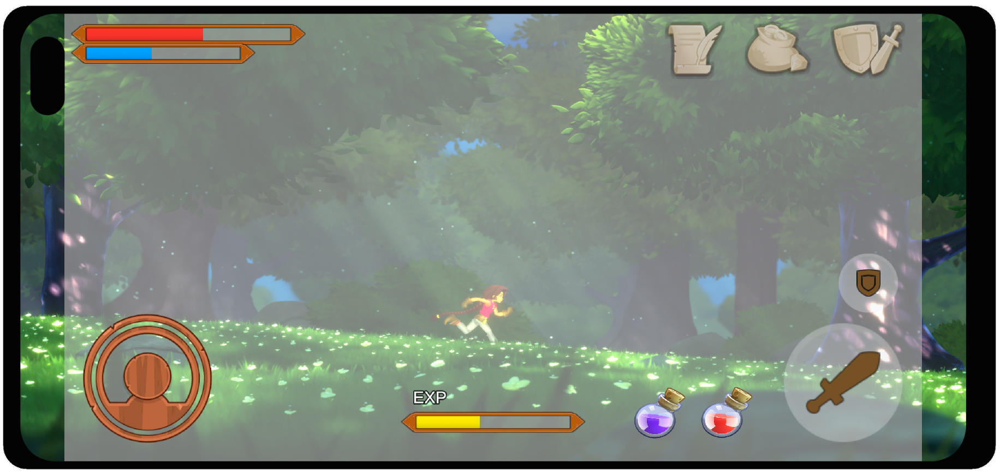

# Safe Area

The Safe Area component constrains a UI element to the device’s reported safe area (`Screen.safeArea`). This is useful on mobile devices with display cutouts (for example, notches), rounded corners, or system gesture areas. The component updates the attached `RectTransform` anchors so that the UI and its children remain within the safe region as the resolution and orientation change.



## Properties

|**Property:**|**Function:**|
|:---|:---|
|**Reference Orientation**|The orientation that the **Edges** and **Alignment** directions are authored against. At runtime, the component remaps those directions to match the current device orientation.|
|**Edges**|Select which edges that will be inset to respect the safe area. Directions are specified **relative to the Reference Orientation**.|
|&#160;&#160;&#160;&#160;&#160;&#160;&#160;&#160;**Top**|Insets the top edge.|
|&#160;&#160;&#160;&#160;&#160;&#160;&#160;&#160;**Right**|Insets the right edge.|
|&#160;&#160;&#160;&#160;&#160;&#160;&#160;&#160;**Bottom**|Insets the bottom edge.|
|&#160;&#160;&#160;&#160;&#160;&#160;&#160;&#160;**Left**|Insets the left edge.|
|**Alignment**|Optionally equalizes insets to keep the remaining UI area centered. Directions are specified **relative to the Reference Orientation**.|
|&#160;&#160;&#160;&#160;&#160;&#160;&#160;&#160;**Center Horizontally**|Applies the larger of the left/right inset to both sides (after orientation mapping).|
|&#160;&#160;&#160;&#160;&#160;&#160;&#160;&#160;**Center Vertically**|Applies the larger of the top/bottom inset to both sides (after orientation mapping).|

## Details

Safe Area works by reading `Screen.safeArea` and converting it to normalized coordinates, then assigning:

- `RectTransform.anchorMin`
- `RectTransform.anchorMax`

It also resets:

- `RectTransform.offsetMin` to zero
- `RectTransform.offsetMax` to zero

This means the RectTransform’s **anchors define the usable region**, and the element stretches to fill that region. In uGUI terms, this is equivalent to making the safe area container a “frame” that all child UI is laid out within. For background on anchors and RectTransform behavior, refer to the uGUI manual: [RectTransform](class-RectTransform.md)  

### Typical setup

A common setup is to place Safe Area on a top-level container under the Canvas, and put all “must-be-visible” UI under it:

```text
Canvas
 ├─ SafeAreaRoot (RectTransform + Safe Area)
 │   ├─ TopBar
 │   ├─ HUD
 │   └─ Buttons
 └─ Background (optional, can be full-bleed)
EventSystem
```

This pattern lets you keep background artwork full-bleed while ensuring interactive UI stays within the safe area.

### Reference Orientation and direction mapping

The **Edges** and **Alignment** flags are authored relative to **Reference Orientation**. When the device rotates, the component remaps the chosen edges to the correct physical edges on screen.

For example, if you author **Top** relative to **Portrait**, then rotate to landscape, “Top” is mapped to the corresponding edge for that landscape orientation. This makes it possible to author safe-area intent once, while still supporting all four orientations.

### Alignment

|||
|------|------|
|With Alignment||
|Without Alignment||


Alignment is useful when only one side has a large inset (for example, a landscape notch on one side). Without alignment, the remaining UI region shifts off-center. With alignment enabled for the relevant axis, the component applies the larger inset to both sides, preserving centering.

### Interaction with other uGUI components

Safe Area drives the RectTransform’s anchors and offsets. Avoid placing components that also drive the same RectTransform on the same GameObject or the parent GameObject, such as layout controllers (for example, Layout Groups or Content Size Fitter). If you need layout-driven behavior, put those components on child objects and keep Safe Area on a dedicated parent container.

For more on uGUI layout components and how they drive RectTransforms, refer to the uGUI manual: [Auto Layouts](comp-UIAutoLayout.md)

## Hints

* Use Safe Area on a **single root container** (for example, `SafeAreaRoot`) and place most UI under it. Keep only intentionally full-bleed elements (backgrounds, decorative art) outside the safe area container.
* If your UI appears shifted in landscape on devices with asymmetric insets, enable **Center Horizontally** and/or **Center Vertically** (as authored relative to your Reference Orientation).
* Safe Area updates at runtime when `Screen.safeArea`, resolution, or orientation changes. If you animate anchors/offsets on the same RectTransform, expect conflicts.
