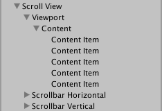

# Scroll Rect

A Scroll Rect can be used when content that takes up a lot of space needs to be displayed in a small area. The Scroll Rect provides functionality to scroll over this content.

Usually a Scroll Rect is combined with a [Mask](script-Mask.md) in order to create a scroll view, where only the scrollable content inside the Scroll Rect is visible. It can also additionally be combined with one or two [Scrollbars](script-Scrollbar.md) that can be dragged to scroll horizontally or vertically.

## Properties

|**Property:** |**Function:** |
|:---|:---|
|**Content** | This is a reference to the Rect Transform of the UI element to be scrolled, for example a large image.  |
|**Horizontal** | Enables horizontal scrolling  |
|**Vertical** | Enables vertical scrolling |
|**Movement Type** |  Unrestricted, Elastic or Clamped.  Use Elastic or Clamped to force the content to remain within the bounds of the Scroll Rect.  Elastic mode bounces the content when it reaches the edge of the Scroll Rect|
|&#160;&#160;&#160;&#160;&#160;&#160;&#160;&#160;**Elasticity** | This is the amount of bounce used in the elasticity mode. |
|**Inertia** | When Inertia is set the content will continue to move when the pointer is released after a drag. When Inertia is not set the content will only move when dragged. |
|&#160;&#160;&#160;&#160;&#160;&#160;&#160;&#160;**Deceleration Rate** | When Inertia is set the deceleration rate determines how quickly the contents stop moving.  A rate of 0 will stop the movement immediately. A value of 1 means the movement will never slow down.|
|**Scroll Sensitivity** | The sensitivity to scroll wheel and track pad scroll events.|
|**Viewport** | Reference to the viewport Rect Transform that is the parent of the content Rect Transform. |
|**Horizontal Scrollbar** | Optional reference to a horizontal scrollbar element. |
|&#160;&#160;&#160;&#160;&#160;&#160;&#160;&#160;**Visibility** | Whether the scrollbar should automatically be hidden when it isn't needed, and optionally expand the viewport as well. |
|&#160;&#160;&#160;&#160;&#160;&#160;&#160;&#160;**Spacing** | The space between the scrollbar and the viewport. |
|**Vertical Scrollbar** | Optional reference to a vertical scrollbar element. |
|&#160;&#160;&#160;&#160;&#160;&#160;&#160;&#160;**Visibility** | Whether the scrollbar should automatically be hidden when it isn't needed, and optionally expand the viewport as well. |
|&#160;&#160;&#160;&#160;&#160;&#160;&#160;&#160;**Spacing** | The space between the scrollbar and the viewport. |

## Events

|**Property:** |**Function:** |
|:---|:---|
|**On Value Changed** | A [UnityEvent](https://docs.unity3d.com/Manual/UnityEvents.html) that is invoked when the scroll position of the Scroll Rect changes. The event can send the current scroll position as a `Vector2` type dynamic argument. |

## Details

The important elements in a scroll view are the **viewport**, the scrolling **content**, and optionally one or two **scrollbars**.

* The root GameObject has the Scroll Rect component.
* The viewport has a [Mask](script-Mask.md) component. The viewport can either be the root GameObject, or a separate GameObject that's a child to the root. If auto-hiding scrollbars are used, it must be a child. The viewport Rect Transform needs to be referenced in the **Viewport** property of the Scroll Rect.
* All the scrolling content must be children of a single content GameObject that is a child to the viewport. The content Rect Transform needs to be referenced in the **Content** property of the Scroll Rect.
* The scrollbars - if used - are children to the root GameObject. See the [Scrollbar](script-Scrollbar.md) page for more details on the setup of a scrollbar and see the section **Scrollbar setup** below for information about setup of scrollbars with a scroll view.

This image shows a setup where the viewport is a child to the scroll view root. This is the default used when using the GameObject > UI > Scroll View menu option.

To scroll content, the input must be received from inside the bounds of the ScrollRect, not on the content itself.

Take care when using Unrestricted scrolling movement as it is possible to lose control of the content in an irretrievable way.  When using Elastic or Constrained movement it is best to position the content so that it starts within the bounds of the ScrollRect, or undesirable behaviour may occur as the RectTransform tries to bring the content back within its bounds.

### Scrollbar setup

Optionally, the Scroll Rect can be linked to a horizontal and/or a vertical **Scrollbar**. These are typically placed in the hierarchy as siblings to the viewport, and when present, should be dragged into the **Horizontal Scrollbar** and **Vertical Scrollbar** properties of the Scroll Rect, respectively. Note that the **Direction** property on such a horizontal Scrollbar should be set to **Left To Right**, and on the vertical Scrollbar to **Bottom To Top**.

The scrollbars can optionally have auto-hiding behaviour that hides the scrollbars if the content doesn't need to scroll because it isn't larger than the viewport. Note that the auto-hiding only ever happens in Play Mode. In Edit Mode the scrollbars are always shown. This prevents marking the scene as dirty when it shouldn't be, and also help authoring content with proportions that there's room for even when the scrollbars are shown.

If one or both scrollbars have their visibility behaviour set to **Auto Hide And Expand View**, the viewport is automatically expanded when the scrollbars are hidden in order to take up the extra room where the scrollbars would otherwise have been. With this setup, the position and size of the **view** is driven by the Scroll Rect, and the width of the **horizontal scrollbar** as well as the height of the **vertical scrollbar** is driven as well. With this setup the viewport as well as the scrollbars must be children to the Scroll Rect root GameObject.

## Hints

* The pivot and anchors of the content RectTransform can be used to determine how the content is aligned inside the scroll view if the content grows or shrinks. If the content should stay aligned with the top, set the anchors to the top of the parent, and set the pivot to the top position.
* See the page [Making UI elements fit the size of their content](HOWTO-UIFitContentSize.md) for information about how to make the content Rect Transform automatically resize to fit the content.
