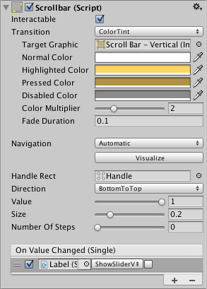

# Scrollbar

The **Scrollbar** control allows the user to scroll an image or other view that is too large to see completely. Note that the similar [Slider](script-Slider.md) control is used for selecting numeric values rather than scrolling. Familiar examples include the vertical Scrollbar at the side of a text editor and the vertical and horizontal pair of bars for viewing a section of a large image or map.

## Properties

|**Property:** |**Function:** |
|:---|:---|
|**Interactable** | Will this component  accept input? See [Interactable](script-Selectable.md). |
|**Transition** | Properties that determine the way the control responds visually to user actions. See [Transition Options](script-SelectableTransition.md). |
|**Navigation** | Properties that determine the sequence of controls. See [Navigation Options](script-SelectableNavigation.md).|
|**Fill Rect** | The graphic used for the background area of the control. |
|**Handle Rect** | The graphic used for the sliding "handle" part of the control |
|**Direction** | The direction in which the Scrollbar's value will increase when the handle is dragged. The options are _Left To Right_, _Right To Left_, _Bottom To Top_ and _Top To Bottom_. |
|**Value** | Initial position value of the Scrollbar, in the range 0.0 to 1.0. |
|**Size** | Fractional size of the handle within the Scrollbar, in the range 0.0 to 1.0. |
|**Number Of Steps** | The number of distinct scroll positions allowed by the Scrollbar. |

## Events

|**Property:** |**Function:** |
|:---|:---|
|**On Value Changed** | A [UnityEvent](https://docs.unity3d.com/Manual/UnityEvents.html) that is invoked when the current value of the Scrollbar changes. The event can send the value as a `float` type dynamic argument. |

## Details

The value of a Scrollbar is determined by the position of the handle along its length with the value being reported as a fraction between the extreme ends. For example, the default left-to-right bar has a value of 0.0 at the left end, 1.0 at the right end and 0.5 indicates the halfway point. A scrollbar can be oriented vertically by choosing _Top To Bottom_ or _Bottom To Top_ for the _Direction_ property.

A significant difference between the Scrollbar and the similar [Slider](script-Slider.md) control is that the Scrollbar's handle can change in size to represent the distance of scrolling available; when the view can scroll only a short way, the handle will fill up most of the bar and only allow a slight shift either direction.

The Scrollbar has a single event called _On Value Changed_ that responds as the user drags the handle. The current value is passed to the event function as a `float` parameter. Typical use cases for a scrollbar include:

* Scrolling a piece of text vertically.
* Scrolling a timeline horizontally.
* Used as a pair, scrolling a large image both horizontally and vertically to view a zoomed section. The size of the handle changes to indicate the degree of zooming and therefore the available distance for scrolling.
