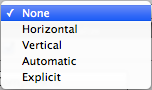
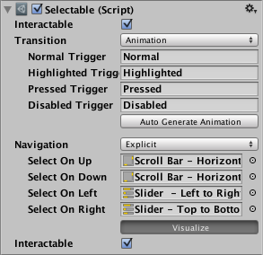
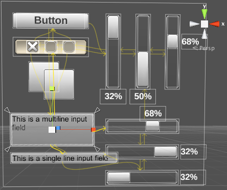

# Navigation Options

|**Property:** |**Function:** |
|:---|:---|
|**Navigation** | The Navigation options refers to how the navigation of UI elements in play mode will be controlled. |
|**None** | No keyboard navigation.  Also ensures that it does not receive focus from clicking/tapping on it.  |
|**Horizontal** | Navigates Horizontally. |
|**Vertical** | Navigates Vertically. |
|**Automatic** | Automatic Navigation. |
|**Explicit** | In this mode you can explicitly specify where the control navigates to for different arrow keys. |
|**Visualize** | Selecting Visualize gives you a visual representation of the navigation you have set up in the scene window. See below. |

In the above visualization mode, the arrows indicate how the change of focus is set up for the collection of controls as a group. That means - for each individual UI control - you can see which UI control will get focus next, if the user presses an arrow key when the given control has focus. So in the example shown above, If the "button" has focus and the user presses the right arrow key, the first (left-hand) vertical slider will then become focused. Note that the vertical sliders can't be focused-away-from using up or down keys, because they control the value of the slider. The same is true of the horizontal sliders and the left/right arrow keys.
