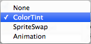
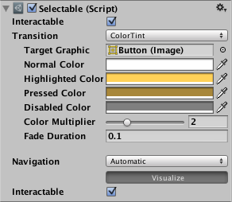
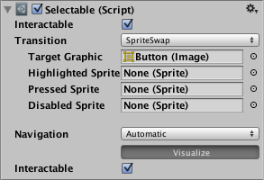
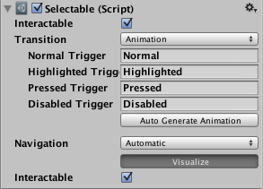

# Transition Options

Within a selectable component there are several transition options depending on what state the selectable is currently in. The different states are: normal, highlighted, pressed and disabled.

|**Transition Options:** |**Function:** |
|:---|:---|
|**None** | This option is for the button to have no state effects at all.|
|**Color Tint** | Changes the colour of the button depending on what state it is in. It is possible to select the colour for each individual state. It is also possible to set the Fade Duration between the different states. The higher the number is, the slower the fade between colors will be. |
|**Sprite Swap** | Allows different sprites to display depending on what state the button is currently in, the sprites can be customised.|
|**Animation** | Allows animations to occur depending on the state of the button, an animator component must exist in order to use animation transition. It’s important to make sure root motion is disabled. To create an animation controller click on generate animation (or create your own) and make sure that an animation controller has been added to the animator component of the button.|

Each Transition option (except None) provides additional options for controlling the transitions. We'll go into details with those in each of the sections below.

## Color Tint

|**Property:** |**Function:** |
|:---|:---|
|**Target Graphic** | The graphic used for the interaction component.|
|**Normal Color** |The normal color of the control  |
|**Highlighted Color** |The color of the control when it is highlighted  |
|**Pressed Color** |The color of the control when it is pressed  |
|**Disabled Color** |The color of the control when it is disabled  |
|**Color Multiplier** | This multiplies the tint color for each transition by its value. With this you can create colors greater than 1 to brighten the colors (or alpha channel) on graphic elements whose base color is less than white (or less then full alpha). |
|**Fade Duration** |The time taken, in seconds,  to fade from one state to another  |

## Sprite Swap

|**Property:** |**Function:** |
|:---|:---|
|**Target Graphic** | The normal sprite to use |
|**Highlighted Sprite** | Sprite to use when the control is highlighted |
|**Pressed Sprite** | Sprite to use when the control is pressed |
|**Disabled Sprite** | Sprite to use when the control is disabled |

## Animation

|**Property:** |**Function:** |
|:---|:---|
|**Normal Trigger** | The normal animation trigger to use |
|**Highlighted Trigger** | Trigger to use when the control is highlighted |
|**Pressed Trigger** | Trigger to use when the control is pressed |
|**Disabled Trigger** | Trigger to use when the control is disabled |
