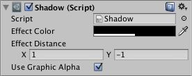

# Shadow

The Shadow component adds a simple outline effect to graphic components such as Text or Image. It must be on the same GameObject as the graphic component.

## Properties

|**Property:** |**Function:** |
|:---|:---|
|**Effect Color** | The color of the shadow. |
|**Effect Distance** | The offset of the shadow expressed as a vector. |
|**Use Graphic Alpha** | Multiplies the color of the graphic onto the color of the effect. |
