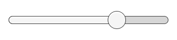
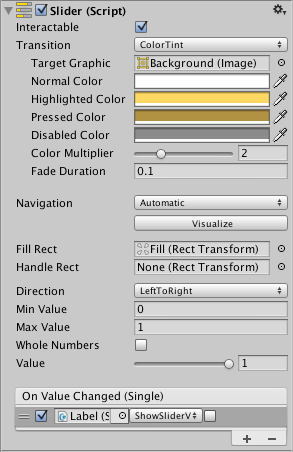

# Slider

The **Slider** control allows the user to select a numeric value from a predetermined range by dragging the mouse. Note that the similar [ScrollBar](script-Scrollbar.md) control is used for scrolling rather than selecting numeric values. Familiar examples include difficulty settings in games and brightness settings in image editors.

## Properties

|**Property:** |**Function:** |
|:---|:---|
|**Interactable** | Will this component accept input? See [Interactable](script-Selectable.md). |
|**Transition** | Properties that determine the way the control responds visually to user actions. See [Transition Options](script-SelectableTransition.md). |
|**Navigation** | Properties that determine the sequence of controls. See [Navigation Options](script-SelectableNavigation.md).|
|**Fill Rect** | The graphic used for the fill area of the control. |
|**Handle Rect** | The graphic used for the sliding "handle" part of the control |
|**Direction** | The direction in which the slider's value will increase when the handle is dragged. The options are _Left To Right_, _Right To Left_, _Bottom To Top_ and _Top To Bottom_. |
|**Min Value** | The value of the slider when the handle is at its extreme lower end (determined by the _Direction_ property). |
|**Max Value** | The value of the slider when the handle is at its extreme upper end (determined by the _Direction_ property). |
|**Whole Numbers** | Should the slider be constrained to integer values? |
|**Value** | Current numeric value of the slider.  If the value is set in the inspector it will be used as the initial value, but this will change at runtime when the value changes. |

## Events

|**Property:** |**Function:** |
|:---|:---|
|**On Value Changed** | A [UnityEvent](https://docs.unity3d.com/Manual/UnityEvents.html) that is invoked when the current value of the Slider has changed. The event can send the current value as a `float` type dynamic argument. The value is passed as a float type regardless of whether the _Whole Numbers_ property is enabled. |

## Details

The value of a Slider is determined by the position of the handle along its length. The value increases from the _Min Value_ up to the _Max Value_ in proportion to the distance the handle is dragged. The default behaviour is for the slider to increase from left to right but it is also possible to reverse this behavior using the _Direction_ property. You can also set the slider to increase vertically by selecting _Bottom To Top_ or _Top To Bottom_ for the _Direction_ property.

The slider has a single event called _On Value Changed_ that responds as the user drags the handle. The current numeric value of the slider is passed to the function as a `float` parameter. Typical use cases include:

* Choosing a level of difficulty in a game, brightness of a light, etc.
* Setting a distance, size, time or angle.
