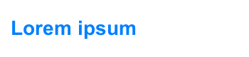

# Text

The **Text** control displays a non-interactive piece of text to the user. This can be used to provide captions or labels for other GUI controls or to display instructions or other text.

## Properties

|**Property:** |**Function:** |
|:---|:---|
|**Text** |The text displayed by the control. |
| **Character** |
| **Font** | The [Font](https://docs.unity3d.com/Manual/class-Font.html) used to display the text. |
|**Font Style** | The style applied to the text. The options are _Normal_, _Bold_, _Italic_ and _Bold And Italic_. |
|**Font Size** | The size of the displayed text. |
|**Line Spacing** | The vertical separation between lines of text. |
|**Rich Text** | Should markup elements in the text be interpreted as [Rich Text](StyledText.md) styling? |
|**Paragraph**|
|**Alignment** | The horizontal and vertical alignment of the text. |
|**Align by Geometry** | Use the extents of glyph geometry to perform horizontal alignment rather than glyph metrics. |
|**Horizontal Overflow** | The method used to handle the situation where the text is too wide to fit in the rectangle. The options are _Wrap_ and _Overflow_. |
|**Vertical Overflow** | The method used to handle the situation where wrapped text is too tall to fit in the rectangle. The options are _Truncate_ and _Overflow_. |
|**Best Fit** | Should Unity ignore the size properties and simply try to fit the text to the control's rectangle? |
| | |
|**Color** | The color used to render the text. |
|**Material** | The [Material](https://docs.unity3d.com/Manual/class-Material.html) used to render the text. |

A default text element looks like this:

## Details

Some controls (such as [Buttons](script-Button.md) and [Toggles](script-Toggle.md)) have textual descriptions built-in. For controls that have no implicit text (such as [Sliders](script-Slider.md)), you can indicate the purpose using a label created with a Text control. Text is also useful for lists of instructions, story text, conversations and legal disclaimers.

The Text control offers the usual parameters for font size, style, etc, and text alignment. When the _Rich Text_ option is enabled, markup elements within the text will be treated as styling information, so you can have just a single word or short section in boldface or in a different color, say (see the page about [Rich Text](StyledText.md) for details of the markup scheme).

## Hints

* See the [Effects](comp-UIEffects.md) page for how to apply a simple shadow or outline effect to the text.
