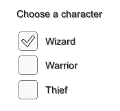
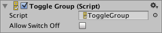

# Toggle Group

A **Toggle Group** is not a visible UI control but rather a way to modify the behavior of a set of [Toggles](script-Toggle.md). Toggles that belong to the same group are constrained so that only one of them can switched on at a time - pressing one of them to switch it on automatically switches the others off.

## Properties

|**Property:** |**Function:** |
|:---|:---|
|**Allow Switch Off** | Is it allowed that no toggle is switched on? If this setting is enabled, pressing the toggle that is currently switched on will switch it off, so that no toggle is switched on. If this setting is disabled, pressing the toggle that is currently switched on will not change its state. |

## Description

The Toggle Group is setup by dragging the Toggle Group object to the _Group_ property of each of the Toggles in the group.

Toggle Groups are useful anywhere the user must make a choice from a mutually exclusive set of options. Common examples include selecting player character types, speed settings (slow, medium, fast, etc), preset colors and days of the week. You can have more than one Toggle Group object in the scene at a time, so you can create several separate groups if necessary.

Unlike other UI elements, an object with a Toggle Group component does not need to be a child of a [Canvas](class-Canvas.md) object, although the Toggles themselves still do.

Note that the Toggle Group will not enforce its constraint right away if multiple toggles in the group are switched on when the scene is loaded or when the group is instantiated. Only when a new toggle is swicthed on are the others switched off. This means it's up to you to ensure that only one toggle is switched on from the beginning.
